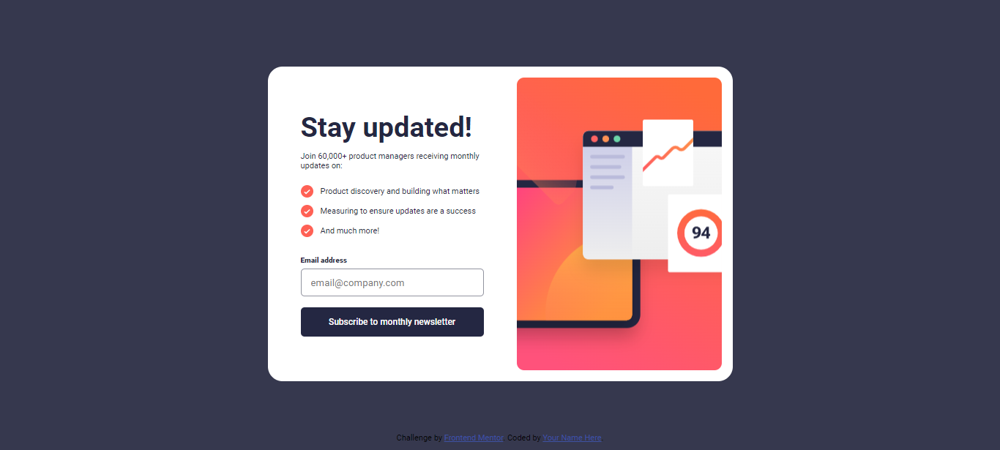

# Frontend Mentor - Newsletter sign-up form with success message solution

This is a solution to the [Newsletter sign-up form with success message challenge on Frontend Mentor](https://www.frontendmentor.io/challenges/newsletter-signup-form-with-success-message-3FC1AZbNrv). Frontend Mentor challenges help you improve your coding skills by building realistic projects. 

## Table of contents

- [Design](#design)
- [Links](#links)
- [Author](#author)

### Design

### Links

- [Frontend Mentor Solution](https://www.frontendmentor.io/solutions/newsletter-signup-form-with-success-message-2MwKgIWI4y)
- [Live Site](https://plutuxx.github.io/Newsletter-sign-up-form-with-success-message.io/)

## Author

- Frontend Mentor - [@plutuxx](https://www.frontendmentor.io/profile/plutuxx)
